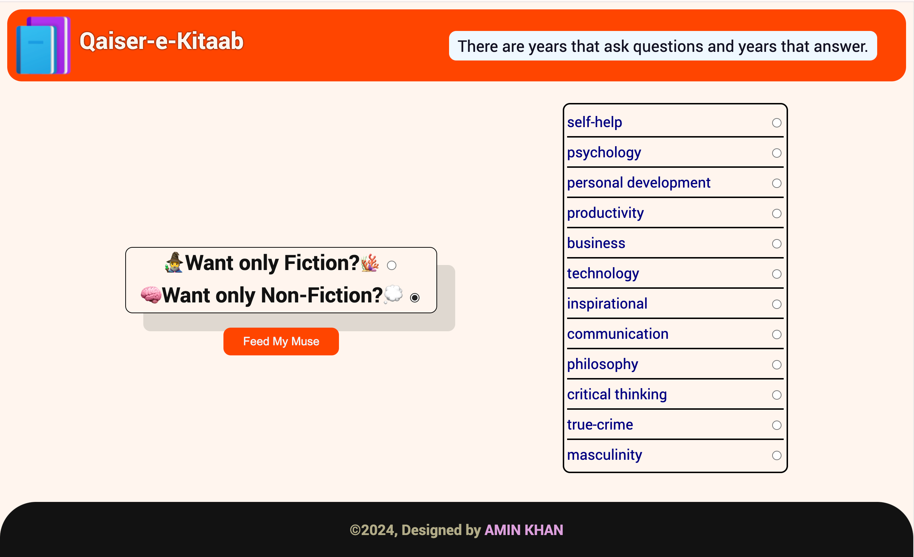

# Feed My Muse 📚

**Qaiser-e-Kitaab** is a minimalist book generator where you select your favorite genre, click *Feed My Muse*, and receive book recommendations to inspire and delight.



## Features
- **Get Personalized Book Recommendations**: Choose a genre and receive curated suggestions instantly.
- **Inspire Your Reading Journey**: Use Feed My Muse to discover books across various genres tailored to your tastes.

## Installation
1. **Download/Clone the Repository**: 
   ```bash
   git clone https://github.com/Aminkhan-mid/Feed-My-Muse.git

2. **Open in Your Preferred IDE**:  
Open the cloned repository in your IDE (like VS Code) to begin exploring or customizing.

### Usage
- **Choosing a Genre**: Select your desired genre from the list.
- **Generating Recommendations**: Click the *Feed My Muse* button to receive book recommendations suited to your taste.

### File Structure
- **index.html**: HTML structure for the main interface.
- **index.css**: CSS file for styling the user interface.
- **index.js**: JavaScript file for fetching and displaying book recommendations.
- **data.js**: All the books data is stored here.
- **README.md**: Information and usage instructions for Feed My Muse.

### Contributing
Want to enhance Feed My Muse? Feel free to fork the repository and submit pull requests with improvements, new features, or bug fixes. All contributions are appreciated!

### License
This project is open-source and available under the MIT License.
